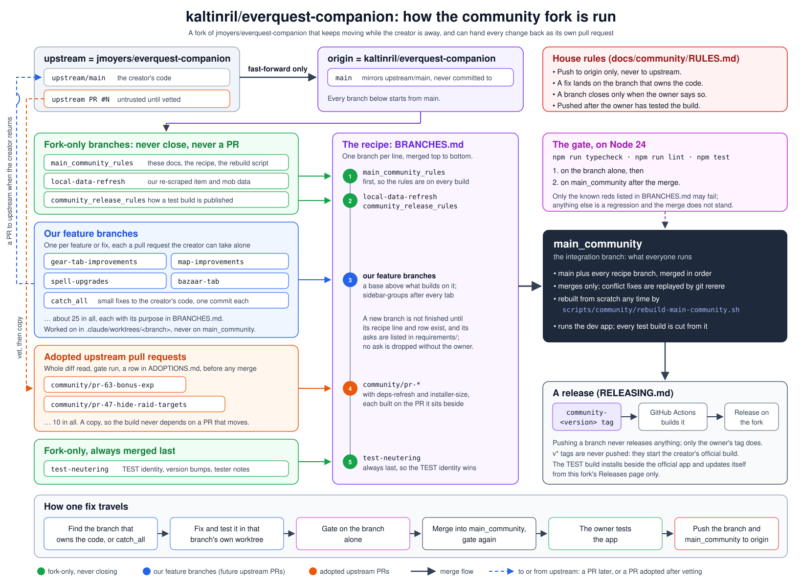

# EQ Legends Companion: community edition

A Windows desktop companion for **EverQuest Legends** that reads the log file the game already
writes and turns it into live views: a DPS meter, floating overlays, quest, loot and gear
tracking, alerts.

This is a community continuation of [**EQ Legends Companion**](https://github.com/jmoyers/everquest-companion)
by **Josh Moyers**. He built the app, its engine and almost everything you will use in it; this
fork exists only to keep it moving while he is away. All the credit for the app is his. Everything
we add is kept as separate changes he can take back into his own repo, or leave, when he returns.

**It only reads your log.** Nothing is injected into EverQuest, no game files are touched, no
memory is read, and nothing is automated or played for you.

## Download

**Requires 64-bit Windows 10 or 11.**

1. Download the newest `everquest-companion-test-Setup-<version>.exe` from this fork's
   [**Releases**](https://github.com/kaltinril/everquest-companion/releases/latest) page.
2. Run it. Windows SmartScreen will say "Windows protected your PC", because the community
   build is not code-signed: click **More info**, then **Run anyway**.
3. In EverQuest, type `/log on`.

The community build installs **beside** the original app, with its own name and its own
settings, so the two never overwrite each other. It updates itself from this fork's Releases page
and from nowhere else. Telemetry and feedback uploads are switched off.

## What the community edition adds

Highlights; each release's notes on the [Releases](https://github.com/kaltinril/everquest-companion/releases)
page list everything.

- **New tabs:** Bazaar (what trade chat asks and offers, with a watchlist that alerts),
  Factions, Achievements with a Slayer zone planner, Unlocks, and a full Spells area with
  spellbook, loadouts and buff stacking.
- **Gear and planning:** drop sources, worth scores, the +0 to +10 upgrade slider, a level
  route with recommended gear, the Exaltations socket board optimizer.
- **Maps:** clickable zone links, mob pins, travel routes, ports, and where to level.
- **Log archive:** keep your history while starting a fresh, small log file.
- **Fixes** to the original's parsing, buffs, debuffs and loot, and community pull requests to
  the original repo that were reviewed before being taken in.

## Reporting a problem

Open an issue on [**this fork's Issues page**](https://github.com/kaltinril/everquest-companion/issues).
When the cause turns out to be in the original app's code, we also file it, courteously and with
the evidence, on the original repo, so the fix can reach everyone.

## How this fork is run

The original app's `main` comes down unchanged and is never edited here. Every change of ours is
its own branch, so each one can go back to the original as its own pull request. The branches are
merged in a fixed order into `main_community`, the branch this page shows and every release is
built from. The rules, the merge order and the record of every outside pull request we reviewed
are in [docs/community](../docs/community/README.md).

## The original app

- **Its README**, unchanged, is [README.md](../README.md) in this repo: features, settings,
  development setup and the creator's own thanks.
- **Its repo** is [jmoyers/everquest-companion](https://github.com/jmoyers/everquest-companion).
  Its releases have not been updated since the creator went on hiatus (last release v1.16.0).

## License

The same as the original: [FSL-1.1-MIT](../LICENSE), copyright 2026 Josh Moyers. The licence
permits sharing and changing the app for any purpose other than a competing commercial product.
